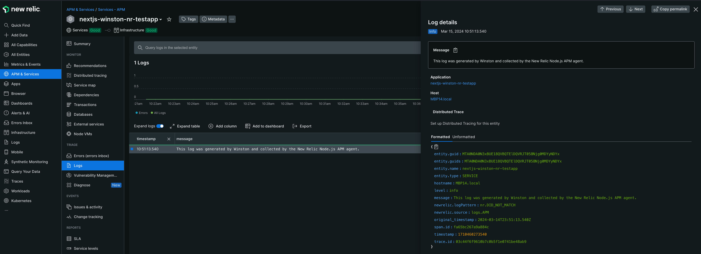

# Next.js Application with Winston Logging and New Relic

This guide outlines how to integrate Winston for logging and New Relic for application monitoring in a Next.js application.

## Getting Started

### 1. Instsall Dependencies

```bash
npm install
```

### 2. Modify newrelic.js.template

- Rename newrelic.js.template to newrelic.js
- Edit newrelic.js and replace ```bash <New Relic License Key> ``` with your New Relic Ingest API Key


### 3. Run Your Application

Start your Next.js application with:

```bash
npm run dev
```

- Navigate to http://localhost:3000/ 

- You should see a button in the middle of the screen called "Click me to send log to New Relic"

- When you click this, it should trigger a ```javascript logger.info('This log was generated by Winston and collected by the New Relic Node.js APM agent.'); ``` in the `api/winstonexample.js` file which will be collected by the New Relic Node.js APM agent and contextualise this log against your New Relic APM entity in the New Relic account connected to the Ingestion API Key you inserted in the `newrelic.js` file. 

- Navigate to to an APM entity in your New Relic account called `nextjs-winston-nr-testapp` (assuming you have not changed the name) - and on the Navigation section on the left, click "Logs" 

- Note: first launch and first click will take a moment as the entity needs to be generated, subsequet clicks after the first logs show up in the New Relic APM > Log page, all subsequet clicks should be near real-time. 




### How Winston was setup for Logging with New Relic Node.js APM agent

Create a `logger.js` file in your project (e.g., `utils/logger.js`) with the following Winston configuration:

```javascript
// utils/logger.js
const winston = require('winston');

const logger = winston.createLogger({
  level: 'info',
  format: winston.format.combine(
    winston.format.timestamp(),
    winston.format.json()
  ),
  transports: [
    new winston.transports.Console(),
  ],
});

module.exports = logger;
```

### Configure New Relic

- **Create a New Relic Configuration File**: Copy the New Relic configuration template and customize it with your license key and application name:

  ```bash
  cp node_modules/newrelic/newrelic.js .
  ```

- **Import New Relic**: To enable New Relic monitoring, import it at the beginning of your application's entry point (e.g., `pages/_app.js` or `pages/index.js`):

  ```javascript
  require('newrelic');
  ```

### Implement Winston Logging

Modify any React.js server side component (e.g., `api/winstonexample.js`) 

```javascript
require('newrelic');

import logger from '../../utils/logger'; //Refer to the logger.js file in the utils folder
export default function handler(req, res) {
  logger.info('This log was generated by Winston and collected by the New Relic Node.js APM agent.');

  res.status(200).json({ message: 'Log sent to New Relic successfully.' });
}

```

### Made change to index.js to trigger the backend next.js 

Just made a simple button on the homepage that does a fetch() to the previously created windstonexample.js api

```javascript
export default function Home() {
  const sendLog = async () => {
    const response = await fetch('/api/winstonexample');
    const data = await response.json();
    console.log(data); // This is just for demonstration
  };
```
